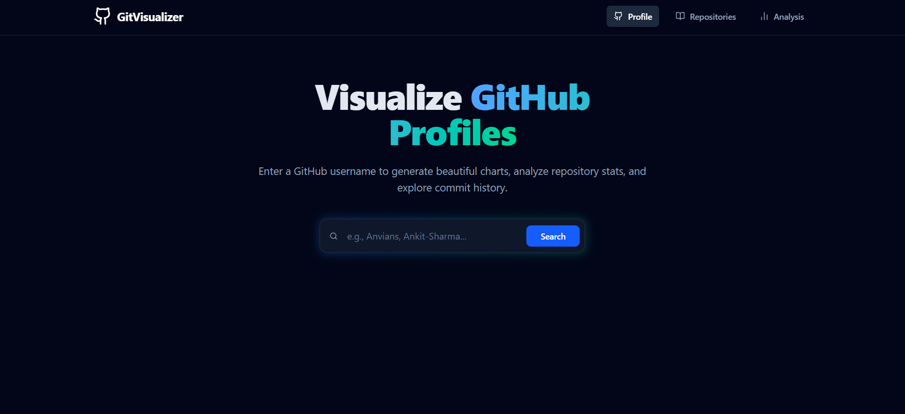

# 🚀 GitVisualizer

A sleek, modern GitHub Profile Visualizer built to transform raw GitHub data into beautiful, interactive dashboards. Enter any GitHub username to instantly generate a comprehensive profile overview, explore repository metrics, and visualize language and commit data through dynamic charts.


 ## ✨ Features
* **Real-time Data Fetching:** Interacts directly with the public GitHub REST API to pull live user data, repositories, and statistics.
* **Sleek Glassmorphism UI:** Designed with a modern, dark-mode aesthetic using Tailwind CSS and backdrop-blur utilities.
* **Fluid Animations:** Utilizes Framer Motion for buttery-smooth page transitions, staggered list renders, and dynamic layout routing.
* **Interactive Data Visualization:** Implements Recharts to render beautiful, responsive pie charts (for language distribution) and bar charts (for repository popularity).
* **Responsive Design:** Fully optimized for mobile, tablet, and desktop viewing.
* **Robust Error Handling:** Custom error states and loaders ensure a smooth user experience even when API limits are hit or invalid users are searched.

## 🛠️ Tech Stack

* **Frontend Framework:** React 18 (Bootstrapped with Vite for lightning-fast HMR)
* **Routing:** React Router v6
* **Styling:** Tailwind CSS
* **Animations:** Framer Motion
* **Data Visualization:** Recharts
* **Icons:** Lucide React
* **HTTP Client:** Axios

## 🚀 Local Development Setup

To get a local copy up and running, follow these simple steps.

### Prerequisites
* Node.js (v16 or higher)
* npm or yarn

### Installation

1. **Clone the repository**
   ```bash
   git clone [https://github.com/Anvians/gitvisualizer.git](https://github.com/Anvians/GitVisualizer.git)
   cd GitVisualizer